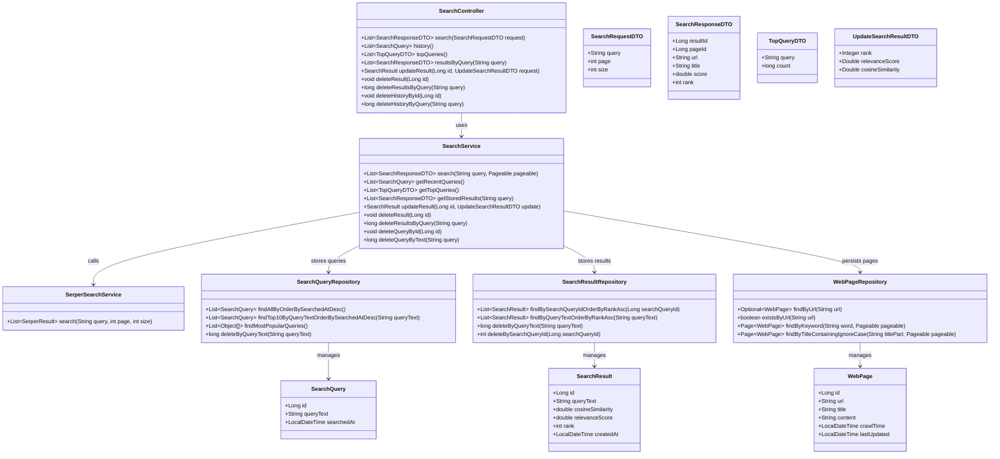

# Realtime Web Page Search Engine


## Description
Realtime Web Page Search Engine is a search backend with a simple UI. It fetches live search results, computes relevance signals, and stores queries/results in MySQL for inspection, analytics, and reuse. It is built for students and developers who want a transparent, inspectable search pipeline rather than a black-box search experience.

## Features

- Realtime search with pagination support.
- Relevance scoring based on rank plus cosine similarity metrics stored for analysis.
- Search history, top queries, and stored results retrieval.
- Update and delete operations for stored results and history.
- Web UI pages: Search (`/`), History (`/history.html`), Top Queries (`/top.html`), Stored Results (`/stored.html`).

## Architecture Diagram


## API Endpoints

| Method | Path | Description |
| --- | --- | --- |
| POST | `/api/search` | Searches the web via Serper and returns ranked results with relevance score. |
| GET | `/api/search/history` | Returns all search queries ordered by most recent. |
| GET | `/api/search/top` | Returns the 10 most frequent search queries. |
| GET | `/api/search/results?query=...` | Returns stored results for a given query from MySQL. |
| PUT | `/api/search/results/{id}` | Updates rank or scores for a stored result. |
| DELETE | `/api/search/results/{id}` | Deletes a stored result by id. |
| DELETE | `/api/search/results?query=...` | Deletes stored results for a given query. |
| DELETE | `/api/search/history/{id}` | Deletes a search query by id. |
| DELETE | `/api/search/history?query=...` | Deletes search history by query text. |

### `POST /api/search`

Request body (fields):
- `query` (string, required): search text.
- `page` (number, required): zero-based page index.
- `size` (number, required): page size.

Request example:
```json
{
  "query": "saveetha engineering colge",
  "page": 0,
  "size": 10
}
```

Response body (array of results):
- `resultId` (number): stored result id (for updates/deletes).
- `pageId` (number): stored web page id.
- `url` (string): result URL.
- `title` (string): result title.
- `score` (number): relevance score.
- `rank` (number): rank position.

Response example:
```json
[
  {
    "resultId": 5,
    "pageId": 1,
    "url": "https://example.com",
    "title": "Example",
    "score": 1.0,
    "rank": 1
  }
]
```

Status codes:
- `200 OK` on success.
- `400 Bad Request` if `query` is empty.

Error response example:
```json
{
  "timestamp": "2026-02-11T23:05:34.7832449",
  "status": 400,
  "error": "Bad Request",
  "message": "Query cannot be empty"
}
```

### `GET /api/search/history`

Response body (array of searches):
- `id` (number): query id.
- `queryText` (string): searched text.
- `searchedAt` (string, ISO-8601): timestamp.

Response example:
```json
[
  {
    "id": 12,
    "queryText": "saveetha engineering colge",
    "searchedAt": "2026-02-10T12:30:00"
  }
]
```

Status codes:
- `200 OK` on success.

Error response example:
```json
{
  "timestamp": "2026-02-11T23:05:34.7832449",
  "status": 500,
  "error": "Internal Server Error",
  "message": "Unable to load history"
}
```

### `GET /api/search/top`

Response body (array of top queries):
- `query` (string): query text.
- `count` (number): total searches.

Response example:
```json
[
  {
    "query": "saveetha engineering colge",
    "count": 5
  }
]
```

Status codes:
- `200 OK` on success.

Error response example:
```json
{
  "timestamp": "2026-02-11T23:05:34.7832449",
  "status": 500,
  "error": "Internal Server Error",
  "message": "Unable to load top queries"
}
```

### `GET /api/search/results?query=saveetha%20engineering%20colge`

Response body (array of stored results):
- `resultId` (number): stored result id.
- `pageId` (number): stored web page id.
- `url` (string): result URL.
- `title` (string): result title.
- `score` (number): relevance score.
- `rank` (number): rank position.

Response example:
```json
[
  {
    "resultId": 5,
    "pageId": 1,
    "url": "https://example.com",
    "title": "Example",
    "score": 1.0,
    "rank": 1
  }
]
```

Status codes:
- `200 OK` on success.
- `400 Bad Request` if `query` is empty.

Error response example:
```json
{
  "timestamp": "2026-02-11T23:05:34.7832449",
  "status": 400,
  "error": "Bad Request",
  "message": "Query cannot be empty"
}
```

### `PUT /api/search/results/{id}`

Request body (any subset is allowed):
- `rank` (number, optional)
- `relevanceScore` (number, optional)
- `cosineSimilarity` (number, optional)

Request example:
```json
{
  "rank": 1,
  "relevanceScore": 1.0,
  "cosineSimilarity": 0.42
}
```

Response body:
- `id` (number)
- `queryText` (string)
- `cosineSimilarity` (number)
- `relevanceScore` (number)
- `rank` (number)

Response example:
```json
{
  "id": 5,
  "queryText": "saveetha engineering colge",
  "cosineSimilarity": 0.42,
  "relevanceScore": 1.0,
  "rank": 1
}
```

Status codes:
- `200 OK` on success.
- `404 Not Found` if result id does not exist.

Error response example:
```json
{
  "timestamp": "2026-02-11T23:05:34.7832449",
  "status": 404,
  "error": "Not Found",
  "message": "Result not found"
}
```

### `DELETE /api/search/results/{id}`

Response body:
```
204 No Content
```

Status codes:
- `204 No Content` on success.
- `404 Not Found` if result id does not exist.

Error response example:
```json
{
  "timestamp": "2026-02-11T23:05:34.7832449",
  "status": 404,
  "error": "Not Found",
  "message": "Result not found"
}
```

### `DELETE /api/search/results?query=saveetha%20engineering%20colge`

Response body (number of deleted rows):
```json
5
```

Status codes:
- `200 OK` on success.
- `400 Bad Request` if `query` is empty.

Error response example:
```json
{
  "timestamp": "2026-02-11T23:05:34.7832449",
  "status": 400,
  "error": "Bad Request",
  "message": "Query cannot be empty"
}
```

### `DELETE /api/search/history/{id}`

Response body:
```
204 No Content
```

Status codes:
- `204 No Content` on success.
- `404 Not Found` if query id does not exist.
- `500 Internal Server Error` if results still reference the query.

Error response example:
```json
{
  "timestamp": "2026-02-11T23:05:34.7832449",
  "status": 404,
  "error": "Not Found",
  "message": "Query not found"
}
```

### `DELETE /api/search/history?query=saveetha%20engineering%20colge`

Response body (number of deleted rows):
```json
3
```

Status codes:
- `200 OK` on success.
- `400 Bad Request` if `query` is empty.

Error response example:
```json
{
  "timestamp": "2026-02-11T23:05:34.7832449",
  "status": 400,
  "error": "Bad Request",
  "message": "Query cannot be empty"
}
```

## Class Diagram



## Workflow

1. User opens the frontend at `/` and submits a search query.
2. The frontend sends `POST /api/search` with `query`, `page`, and `size`.
3. The backend forwards the query to Serper and receives ranked results.
4. For each result, the backend computes cosine similarity and a relevance score.
5. The backend stores the search query, web page, and ranking data in MySQL.
6. The backend returns the results to the frontend for display.
