# Realtime Search Engine with Profile Isolation & Admin Analytics


## Overview
This project is a secure, profile-driven search platform built with Spring Boot, Spring Security, MySQL, and a React + Vite frontend.
It combines:
- Real-time web search retrieval and relevance scoring
- Profile-level data isolation for history, top queries, and stored results
- Password-protected profile operations (create/open/delete)
- Admin-only analytics over all user profiles
- Modern SPA UX (Tailwind CSS, Framer Motion, Lucide icons, toast feedback, skeleton loading)

The application uses Spring Security with **hybrid authentication**:
- Session auth (Spring Security context / `JSESSIONID`) for stable page-to-page redirects
- Bearer tokens (access + refresh) for API authorization and automatic token refresh
- Role-based authorization (`ROLE_USER`, `ROLE_ADMIN`)


## Key Features
- Profile-first login flow (`/profiles`)
- Password-hashed profile authentication (BCrypt)
- Spring Security hybrid auth (session + token) login/logout APIs
- Profile-scoped search data access enforced in service layer
- Search history management with delete by id or query text
- Top query analytics per profile
- Stored results retrieval/update/delete
- Dedicated admin dashboard (`/admin`) for cross-profile analytics
- Single-page app build pipeline (Vite build output served by Spring Boot)
- Library-based client routing with `react-router-dom` route guards

## UI Pages
- `/profiles` - create/open/delete profiles
- `/` - search page
- `/history` - profile query history
- `/top` - profile top queries
- `/stored` - stored results management
- `/admin-login` - admin login page
- `/admin` - admin analytics dashboard

## Frontend Stack
- React 18 + Vite 5
- React Router DOM 7 (`BrowserRouter`, `Routes`, `Route`, `Navigate`)
- Tailwind CSS 3
- Framer Motion (page transitions / micro-interactions)
- Lucide React icons
- Componentized UI structure (`components/ui`, `pages`, `hooks`, `lib`)

## React Router Handling
This project uses **library-based SPA routing with `react-router-dom`**:

1. `frontend/src/main.jsx` wraps app in `BrowserRouter`.
2. `frontend/src/app.jsx` defines route tree with `Routes` / `Route`:
   - `/`, `/profiles`, `/history`, `/top`, `/stored`, `/admin-login`, `/admin`
3. Route-level protection is handled by wrappers:
   - `ProtectedUserRoute` for user pages
   - `AdminRoute` for admin dashboard
   - unauthenticated users are redirected using `Navigate`
4. Spring serves SPA routes through `SpaController`:
   - `src/main/java/com/example/searchenginebackend/controller/SpaController.java`
   - each app route is forwarded to `/index.html`
5. Security allows SPA/static paths in `SecurityConfig`:
   - `/assets/**`, `/profiles`, `/admin-login`, etc.

## Security Model
- `POST /api/auth/profile-login` creates server session + returns `accessToken` and `refreshToken` (`ROLE_USER`)
- `POST /api/auth/admin-login` creates server session + returns `accessToken` and `refreshToken` (`ROLE_ADMIN`)
- Protected endpoints accept authenticated context from Bearer token (filter) and from active session
- `GET /api/auth/me` resolves identity from Spring Security context
- `POST /api/auth/logout` clears server session/context; frontend clears local tokens

Authorization rules:
- `/api/search/**` -> authenticated user required
- `/api/admin/**` -> authenticated admin required
- `/api/profiles/**` -> public (profile management + verify)
- SPA routes like `/profiles`, `/history`, `/top`, `/stored`, `/admin-login` are publicly accessible entry routes.

Notes:
- Search APIs do not use `X-Profile-Id` anymore.
- Profile id is resolved from authenticated principal in Spring Security context.
- Token signing/parsing: `AuthTokenService`
- Token auth filter: `BearerTokenAuthenticationFilter`
- Session persistence on login is handled in `AuthService.persistAuthentication(...)`

Admin credential property:
- File: `src/main/resources/application.properties`
- Key: `security.admin.password`
- Default fallback: `admin123`
 
JWT properties:
- `security.jwt.secret`
- `security.jwt.expiration-ms`

## API Endpoints

### 1) Auth APIs
| Method | Endpoint | Auth | Purpose | Success Code |
| --- | --- | --- | --- | --- |
| POST | `/api/auth/profile-login` | No | Login as profile user | 200 |
| POST | `/api/auth/admin-login` | No | Login as admin | 200 |
| POST | `/api/auth/refresh` | No (refresh token body) | Rotate and issue new access token | 200 |
| GET | `/api/auth/me` | Bearer Token | Current token identity | 200 |
| POST | `/api/auth/logout` | No | Logout current session | 204 |

### 2) Profile APIs
| Method | Endpoint | Auth | Purpose | Success Code |
| --- | --- | --- | --- | --- |
| POST | `/api/profiles` | No | Create profile | 200 |
| GET | `/api/profiles` | No | List profiles for profile page | 200 |
| POST | `/api/profiles/{id}/verify` | No | Verify profile password | 200 |
| DELETE | `/api/profiles/{id}` | No | Delete profile (password required) | 204 |

### 3) Search APIs (`ROLE_USER`)
| Method | Endpoint | Auth | Purpose | Success Code |
| --- | --- | --- | --- | --- |
| POST | `/api/search` | Yes | Run search + persist query/results | 200 |
| GET | `/api/search/history` | Yes | Get profile search history | 200 |
| GET | `/api/search/top` | Yes | Get profile top queries | 200 |
| GET | `/api/search/results?query=...` | Yes | Get stored results for query | 200 |
| PUT | `/api/search/results/{id}` | Yes | Update stored result (owned by profile) | 200 |
| DELETE | `/api/search/results/{id}` | Yes | Delete stored result by id | 204 |
| DELETE | `/api/search/results?query=...` | Yes | Delete stored results by query text | 200 |
| DELETE | `/api/search/history/{id}` | Yes | Delete one history item | 204 |
| DELETE | `/api/search/history?query=...` | Yes | Delete history rows by query text | 200 |

### 4) Admin APIs (`ROLE_ADMIN`)
| Method | Endpoint | Auth | Purpose | Success Code |
| --- | --- | --- | --- | --- |
| GET | `/api/admin/profiles` | Yes (Admin) | List all profiles | 200 |
| GET | `/api/admin/profiles/{id}/data` | Yes (Admin) | Full analytics for one profile | 200 |

## Example Request / Response

All examples use query text: `saveetha engineering colge`.

### Auth

#### `POST /api/auth/profile-login`
Request
```json
{
  "profileId": 1,
  "password": "user@123"
}
```
Response `200`
```json
{
  "authenticated": true,
  "role": "USER",
  "profileId": 1,
  "displayName": "Saveetha Student",
  "accessToken": "eyJhbGciOiJIUzI1NiIsInR5cCI6IkpXVCJ9...",
  "refreshToken": "eyJhbGciOiJIUzI1NiIsInR5cCI6IkpXVCJ9..."
}
```

#### `POST /api/auth/admin-login`
Request
```json
{
  "password": "admin123"
}
```
Response `200`
```json
{
  "authenticated": true,
  "role": "ADMIN",
  "profileId": null,
  "displayName": "admin",
  "accessToken": "eyJhbGciOiJIUzI1NiIsInR5cCI6IkpXVCJ9...",
  "refreshToken": "eyJhbGciOiJIUzI1NiIsInR5cCI6IkpXVCJ9..."
}
```

#### `POST /api/auth/refresh`
Request
```json
{
  "refreshToken": "eyJhbGciOiJIUzI1NiIsInR5cCI6IkpXVCJ9..."
}
```
Response `200`
```json
{
  "authenticated": true,
  "role": "USER",
  "profileId": 1,
  "displayName": "Saveetha Student",
  "accessToken": "new-access-token",
  "refreshToken": "new-refresh-token"
}
```

#### `GET /api/auth/me`
Request Header
```http
Authorization: Bearer <accessToken>
```
Response `200`
```json
{
  "authenticated": true,
  "role": "USER",
  "profileId": 1,
  "displayName": "Saveetha Student",
  "accessToken": null
}
```

#### `POST /api/auth/logout`
Response `204` (empty body)

### Profiles

#### `POST /api/profiles`
Request
```json
{
  "displayName": "Saveetha Student",
  "password": "user@123"
}
```
Response `200`
```json
{
  "id": 1,
  "displayName": "Saveetha Student",
  "createdAt": "2026-02-17T16:45:12"
}
```

#### `GET /api/profiles`
Response `200`
```json
[
  {
    "id": 1,
    "displayName": "Saveetha Student",
    "createdAt": "2026-02-17T16:45:12"
  },
  {
    "id": 2,
    "displayName": "Saveetha Faculty",
    "createdAt": "2026-02-17T16:50:10"
  }
]
```

#### `POST /api/profiles/{id}/verify`
Request
```json
{
  "password": "user@123"
}
```
Response `200`
```json
{
  "valid": true,
  "message": "Profile unlocked"
}
```

#### `DELETE /api/profiles/{id}`
Request
```json
{
  "password": "user@123"
}
```
Response `204` (empty body)

### Search

Header for all Search/Admin endpoints
```http
Authorization: Bearer <accessToken>
```

#### `POST /api/search`
Request
```json
{
  "query": "saveetha engineering colge",
  "page": 0,
  "size": 10
}
```
Response `200`
```json
[
  {
    "resultId": 120,
    "pageId": 32,
    "url": "https://www.saveetha.ac.in",
    "title": "Saveetha Engineering College",
    "score": 1.0,
    "rank": 1
  }
]
```

#### `GET /api/search/history`
Response `200`
```json
[
  {
    "id": 201,
    "queryText": "saveetha engineering colge",
    "profileId": 1,
    "searchedAt": "2026-02-17T18:20:11"
  }
]
```

#### `GET /api/search/top`
Response `200`
```json
[
  {
    "query": "saveetha engineering colge",
    "count": 4
  }
]
```

#### `GET /api/search/results?query=saveetha%20engineering%20colge`
Response `200`
```json
[
  {
    "resultId": 120,
    "pageId": 32,
    "url": "https://www.saveetha.ac.in",
    "title": "Saveetha Engineering College",
    "score": 1.0,
    "rank": 1
  }
]
```

#### `PUT /api/search/results/{id}`
Request
```json
{
  "rank": 1,
  "relevanceScore": 1.0,
  "cosineSimilarity": 0.42
}
```
Response `200`
```json
{
  "id": 120,
  "queryText": "saveetha engineering colge",
  "cosineSimilarity": 0.42,
  "relevanceScore": 1.0,
  "rank": 1,
  "createdAt": "2026-02-17T18:20:12"
}
```

#### `DELETE /api/search/results/{id}`
Response `204` (empty body)

#### `DELETE /api/search/results?query=saveetha%20engineering%20colge`
Response `200`
```json
3
```

#### `DELETE /api/search/history/{id}`
Response `204` (empty body)

#### `DELETE /api/search/history?query=saveetha%20engineering%20colge`
Response `200`
```json
2
```

### Admin

#### `GET /api/admin/profiles`
Response `200`
```json
[
  {
    "id": 1,
    "displayName": "Saveetha Student",
    "createdAt": "2026-02-17T16:45:12"
  },
  {
    "id": 2,
    "displayName": "Saveetha Faculty",
    "createdAt": "2026-02-17T16:50:10"
  }
]
```

#### `GET /api/admin/profiles/{id}/data`
Response `200`
```json
{
  "profile": {
    "id": 1,
    "displayName": "Saveetha Student",
    "createdAt": "2026-02-17T16:45:12"
  },
  "totalQueries": 12,
  "totalResults": 96,
  "history": [
    {
      "id": 201,
      "queryText": "saveetha engineering colge",
      "searchedAt": "2026-02-17T18:20:11"
    }
  ],
  "topQueries": [
    {
      "query": "saveetha engineering colge",
      "count": 4
    }
  ],
  "storedResults": [
    {
      "resultId": 120,
      "pageId": 32,
      "url": "https://www.saveetha.ac.in",
      "title": "Saveetha Engineering College",
      "score": 1.0,
      "rank": 1
    }
  ]
}
```

## Error Responses

### Application Error Format (`GlobalExceptionHandler`)
```json
{
  "timestamp": "2026-02-11T23:05:34.7832449",
  "status": 400,
  "error": "Bad Request",
  "message": "Query cannot be empty"
}
```

Common cases:
- `400 Bad Request`: invalid input, wrong password, empty query
- `401 Unauthorized`: missing/invalid/expired Bearer token
- `403 Forbidden`: logged in but role not permitted
- `404 Not Found`: profile/result/query id not found
- `500 Internal Server Error`: unhandled server error

## Database Tables
- `profiles`
- `search_queries`
- `search_results`
- `web_pages`
- `keywords`
- `page_keywords`

## Class Diagram

```mermaid
classDiagram
    class SecurityConfig
    class SpaController {
        +String spaEntryPoint()
    }
    class BearerTokenAuthenticationFilter
    class AuthTokenService
    class SecurityUtil {
        +Long currentProfileId()
    }
    class AuthenticatedProfile {
        +Long profileId()
        +String displayName()
    }

    class AuthController {
        +AuthMeResponseDTO profileLogin(ProfileLoginRequestDTO)
        +AuthMeResponseDTO adminLogin(AdminLoginRequestDTO)
        +AuthMeResponseDTO me()
        +void logout(HttpServletResponse)
    }

    class ProfileController {
        +ProfileResponseDTO createProfile(CreateProfileRequestDTO)
        +List~ProfileResponseDTO~ publicProfiles()
        +ProfileVerifyResponseDTO verifyProfile(Long, VerifyProfileRequestDTO)
        +void deleteProfile(Long, DeleteProfileRequestDTO)
    }

    class SearchController {
        +List~SearchResponseDTO~ search(SearchRequestDTO)
        +List~SearchQuery~ history()
        +List~TopQueryDTO~ topQueries()
        +List~SearchResponseDTO~ resultsByQuery(String)
        +SearchResult updateResult(Long, UpdateSearchResultDTO)
        +void deleteResult(Long)
        +long deleteResultsByQuery(String)
        +void deleteHistoryById(Long)
        +long deleteHistoryByQuery(String)
    }

    class AdminController {
        +List~ProfileResponseDTO~ adminProfiles()
        +AdminProfileDataDTO adminProfileData(Long)
    }

    class AuthService {
        +AuthMeResponseDTO loginProfile(Long, String)
        +AuthMeResponseDTO loginAdmin(String)
        +AuthMeResponseDTO me()
        +void logout(HttpServletResponse)
    }

    class ProfileService {
        +ProfileResponseDTO createProfile(CreateProfileRequestDTO)
        +List~ProfileResponseDTO~ getPublicProfiles()
        +List~ProfileResponseDTO~ getAllProfilesForAdmin()
        +ProfileVerifyResponseDTO verifyProfilePassword(Long, String)
        +void deleteProfile(Long, String)
    }

    class SearchService {
        +List~SearchResponseDTO~ search(String, Pageable, Long)
        +List~SearchQuery~ getRecentQueries(Long)
        +List~TopQueryDTO~ getTopQueries(Long)
        +List~SearchResponseDTO~ getStoredResults(String, Long)
    }

    class AdminService {
        +AdminProfileDataDTO getProfileData(Long)
    }

    class Profile {
        +Long id
        +String displayName
        +String passwordHash
        +LocalDateTime createdAt
    }

    class SearchQuery {
        +Long id
        +String queryText
        +Long profileId
        +LocalDateTime searchedAt
    }

    class SearchResult {
        +Long id
        +String queryText
        +double cosineSimilarity
        +double relevanceScore
        +int rank
        +LocalDateTime createdAt
    }

    class WebPage {
        +Long id
        +String url
        +String title
        +String content
        +LocalDateTime crawlTime
        +LocalDateTime lastUpdated
    }

    AuthController --> AuthService : uses
    SecurityConfig --> BearerTokenAuthenticationFilter : adds filter
    BearerTokenAuthenticationFilter --> AuthTokenService : validates token
    ProfileController --> ProfileService : uses
    SearchController --> SearchService : uses
    SearchController --> SecurityUtil : current profile
    AdminController --> ProfileService : uses
    AdminController --> AdminService : uses
    SpaController --> SecurityConfig : route + auth alignment

    AuthService --> ProfileRepository : validates profile
    AuthService --> AuthTokenService : issues token
    SearchService --> SearchQueryRepository : query persistence
    SearchService --> SearchResultRepository : result persistence
    SearchService --> WebPageRepository : page persistence
    SearchService --> SerperSearchService : external search
    AdminService --> ProfileRepository : reads profiles
    AdminService --> SearchQueryRepository : reads history
    AdminService --> SearchResultRepository : reads results

    SearchResult --> SearchQuery : many-to-one
    SearchResult --> WebPage : many-to-one
```


## End-to-End Flow
1. Open `/profiles`.
2. Create a profile (or select existing profile).
3. Login via `POST /api/auth/profile-login` to establish session and store `accessToken` + `refreshToken`.
4. Navigate to `/` and run searches (session and/or Bearer token auth applies).
5. Use `/history`, `/top`, `/stored` for profile-specific data management.
6. On `401/403`, frontend calls `POST /api/auth/refresh` with `refreshToken` and retries request.
7. Use **Switch Profile** (sidebar) to clear tokens/session hints and return to `/profiles`.
8. Logout via `POST /api/auth/logout` and clear local tokens.
9. For admin analytics, login from `/admin-login` using `POST /api/auth/admin-login`.
10. Fetch `/api/admin/profiles` and `/api/admin/profiles/{id}/data`.

## Environment Variables
- `SPRING_DATASOURCE_URL`
- `SPRING_DATASOURCE_USERNAME`
- `SPRING_DATASOURCE_PASSWORD`
- `SPRING_JPA_HIBERNATE_DDL_AUTO`
- `SPRING_JPA_SHOW_SQL`
- `SERPER_API_BASE_URL`
- `SERPER_API_KEY`
- `SECURITY_ADMIN_PASSWORD`
- `SECURITY_JWT_SECRET`
- `SECURITY_JWT_EXPIRATION_MS`
- `SECURITY_JWT_REFRESH_EXPIRATION_MS`
- `MYSQL_DATABASE`
- `MYSQL_ROOT_PASSWORD`

## Troubleshooting Redirect Glitches
If you see redirect loops or page bounce issues after login/logout/switch-profile:

1. Clear browser auth state:
   - `localStorage.removeItem("authToken")`
   - `localStorage.removeItem("refreshToken")`
   - `sessionStorage.removeItem("activeProfileId")`
   - `sessionStorage.removeItem("activeProfileName")`
2. Refresh the page and login again from `/profiles` or `/admin-login`.
3. Verify backend is running the latest build:
   ```bash
   ./mvnw -DskipTests package
   ```
4. If frontend assets are stale, rebuild:
   ```bash
   cd frontend
   npm run build
   ```
