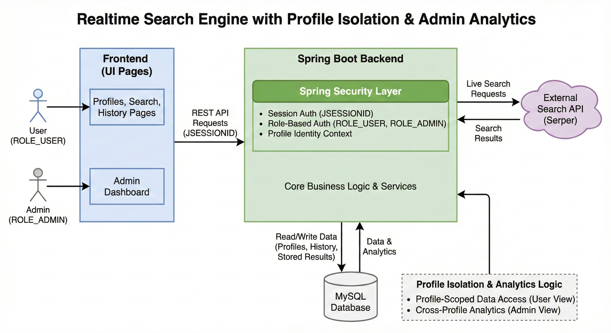
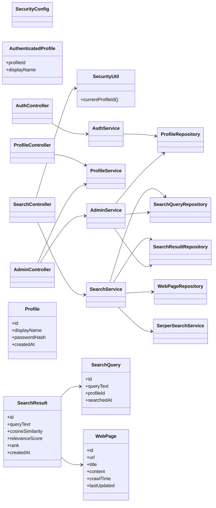

# Realtime Search Engine with Profile Isolation & Admin Analytics


## Overview
This project is a secure, profile-driven search application built with Spring Boot, Spring Security, and MySQL.
It combines:
- Real-time web search retrieval and relevance scoring
- Profile-level data isolation for history, top queries, and stored results
- Password-protected profile operations (create/open/delete)
- Admin-only analytics over all user profiles

The application uses Spring Security's filter chain with server-side session authentication (cookie-based `JSESSIONID`) and role-based authorization (`ROLE_USER`, `ROLE_ADMIN`).


## Architecture Diagram


## Key Features
- Profile-first login flow (`/profiles.html`)
- Password-hashed profile authentication (BCrypt)
- Spring Security session login/logout APIs
- Profile-scoped search data access enforced in service layer
- Search history management with delete by id or query text
- Top query analytics per profile
- Stored results retrieval/update/delete
- Dedicated admin dashboard (`/admin.html`) for cross-profile analytics

## UI Pages
- `/profiles.html` - create/open/delete profiles
- `/` - search page
- `/history.html` - profile query history
- `/top.html` - profile top queries
- `/stored.html` - stored results management
- `/admin.html` - admin login and profile analytics

## Security Model
- `POST /api/auth/profile-login` authenticates a profile user session (`ROLE_USER`)
- `POST /api/auth/admin-login` authenticates an admin session (`ROLE_ADMIN`)
- `GET /api/auth/me` returns the current authenticated identity
- `POST /api/auth/logout` invalidates server session and clears auth context

Authorization rules:
- `/api/search/**` -> authenticated user required
- `/api/admin/**` -> authenticated admin required
- `/api/profiles/**` -> public (profile management + verify)

Notes:
- Search APIs do not use `X-Profile-Id` anymore.
- Profile id is resolved from authenticated principal in Spring Security context.

Admin credential property:
- File: `src/main/resources/application.properties`
- Key: `security.admin.password`
- Default fallback: `admin123`

## API Endpoints

### 1) Auth APIs
| Method | Endpoint | Auth | Purpose | Success Code |
| --- | --- | --- | --- | --- |
| POST | `/api/auth/profile-login` | No | Login as profile user | 200 |
| POST | `/api/auth/admin-login` | No | Login as admin | 200 |
| GET | `/api/auth/me` | Yes | Current session identity | 200 |
| POST | `/api/auth/logout` | No | Logout current session | 204 |

### 2) Profile APIs
| Method | Endpoint | Auth | Purpose | Success Code |
| --- | --- | --- | --- | --- |
| POST | `/api/profiles` | No | Create profile | 200 |
| GET | `/api/profiles` | No | List profiles for profile page | 200 |
| POST | `/api/profiles/{id}/verify` | No | Verify profile password | 200 |
| DELETE | `/api/profiles/{id}` | No | Delete profile (password required) | 204 |

### 3) Search APIs (`ROLE_USER`)
| Method | Endpoint | Auth | Purpose | Success Code |
| --- | --- | --- | --- | --- |
| POST | `/api/search` | Yes | Run search + persist query/results | 200 |
| GET | `/api/search/history` | Yes | Get profile search history | 200 |
| GET | `/api/search/top` | Yes | Get profile top queries | 200 |
| GET | `/api/search/results?query=...` | Yes | Get stored results for query | 200 |
| PUT | `/api/search/results/{id}` | Yes | Update stored result (owned by profile) | 200 |
| DELETE | `/api/search/results/{id}` | Yes | Delete stored result by id | 204 |
| DELETE | `/api/search/results?query=...` | Yes | Delete stored results by query text | 200 |
| DELETE | `/api/search/history/{id}` | Yes | Delete one history item | 204 |
| DELETE | `/api/search/history?query=...` | Yes | Delete history rows by query text | 200 |

### 4) Admin APIs (`ROLE_ADMIN`)
| Method | Endpoint | Auth | Purpose | Success Code |
| --- | --- | --- | --- | --- |
| GET | `/api/admin/profiles` | Yes (Admin) | List all profiles | 200 |
| GET | `/api/admin/profiles/{id}/data` | Yes (Admin) | Full analytics for one profile | 200 |

## Example Request / Response

All examples use query text: `saveetha engineering colge`.

### Auth

#### `POST /api/auth/profile-login`
Request
```json
{
  "profileId": 1,
  "password": "user@123"
}
```
Response `200`
```json
{
  "authenticated": true,
  "role": "USER",
  "profileId": 1,
  "displayName": "Saveetha Student"
}
```

#### `POST /api/auth/admin-login`
Request
```json
{
  "password": "admin123"
}
```
Response `200`
```json
{
  "authenticated": true,
  "role": "ADMIN",
  "profileId": null,
  "displayName": "admin"
}
```

#### `GET /api/auth/me`
Response `200`
```json
{
  "authenticated": true,
  "role": "USER",
  "profileId": 1,
  "displayName": "Saveetha Student"
}
```

#### `POST /api/auth/logout`
Response `204` (empty body)

### Profiles

#### `POST /api/profiles`
Request
```json
{
  "displayName": "Saveetha Student",
  "password": "user@123"
}
```
Response `200`
```json
{
  "id": 1,
  "displayName": "Saveetha Student",
  "createdAt": "2026-02-17T16:45:12"
}
```

#### `GET /api/profiles`
Response `200`
```json
[
  {
    "id": 1,
    "displayName": "Saveetha Student",
    "createdAt": "2026-02-17T16:45:12"
  },
  {
    "id": 2,
    "displayName": "Saveetha Faculty",
    "createdAt": "2026-02-17T16:50:10"
  }
]
```

#### `POST /api/profiles/{id}/verify`
Request
```json
{
  "password": "user@123"
}
```
Response `200`
```json
{
  "valid": true,
  "message": "Profile unlocked"
}
```

#### `DELETE /api/profiles/{id}`
Request
```json
{
  "password": "user@123"
}
```
Response `204` (empty body)

### Search

#### `POST /api/search`
Request
```json
{
  "query": "saveetha engineering colge",
  "page": 0,
  "size": 10
}
```
Response `200`
```json
[
  {
    "resultId": 120,
    "pageId": 32,
    "url": "https://www.saveetha.ac.in",
    "title": "Saveetha Engineering College",
    "score": 1.0,
    "rank": 1
  }
]
```

#### `GET /api/search/history`
Response `200`
```json
[
  {
    "id": 201,
    "queryText": "saveetha engineering colge",
    "profileId": 1,
    "searchedAt": "2026-02-17T18:20:11"
  }
]
```

#### `GET /api/search/top`
Response `200`
```json
[
  {
    "query": "saveetha engineering colge",
    "count": 4
  }
]
```

#### `GET /api/search/results?query=saveetha%20engineering%20colge`
Response `200`
```json
[
  {
    "resultId": 120,
    "pageId": 32,
    "url": "https://www.saveetha.ac.in",
    "title": "Saveetha Engineering College",
    "score": 1.0,
    "rank": 1
  }
]
```

#### `PUT /api/search/results/{id}`
Request
```json
{
  "rank": 1,
  "relevanceScore": 1.0,
  "cosineSimilarity": 0.42
}
```
Response `200`
```json
{
  "id": 120,
  "queryText": "saveetha engineering colge",
  "cosineSimilarity": 0.42,
  "relevanceScore": 1.0,
  "rank": 1,
  "createdAt": "2026-02-17T18:20:12"
}
```

#### `DELETE /api/search/results/{id}`
Response `204` (empty body)

#### `DELETE /api/search/results?query=saveetha%20engineering%20colge`
Response `200`
```json
3
```

#### `DELETE /api/search/history/{id}`
Response `204` (empty body)

#### `DELETE /api/search/history?query=saveetha%20engineering%20colge`
Response `200`
```json
2
```

### Admin

#### `GET /api/admin/profiles`
Response `200`
```json
[
  {
    "id": 1,
    "displayName": "Saveetha Student",
    "createdAt": "2026-02-17T16:45:12"
  },
  {
    "id": 2,
    "displayName": "Saveetha Faculty",
    "createdAt": "2026-02-17T16:50:10"
  }
]
```

#### `GET /api/admin/profiles/{id}/data`
Response `200`
```json
{
  "profile": {
    "id": 1,
    "displayName": "Saveetha Student",
    "createdAt": "2026-02-17T16:45:12"
  },
  "totalQueries": 12,
  "totalResults": 96,
  "history": [
    {
      "id": 201,
      "queryText": "saveetha engineering colge",
      "searchedAt": "2026-02-17T18:20:11"
    }
  ],
  "topQueries": [
    {
      "query": "saveetha engineering colge",
      "count": 4
    }
  ],
  "storedResults": [
    {
      "resultId": 120,
      "pageId": 32,
      "url": "https://www.saveetha.ac.in",
      "title": "Saveetha Engineering College",
      "score": 1.0,
      "rank": 1
    }
  ]
}
```

## Error Responses

### Application Error Format (`GlobalExceptionHandler`)
```json
{
  "timestamp": "2026-02-11T23:05:34.7832449",
  "status": 400,
  "error": "Bad Request",
  "message": "Query cannot be empty"
}
```

Common cases:
- `400 Bad Request`: invalid input, wrong password, empty query
- `401 Unauthorized`: not logged in for protected endpoint
- `403 Forbidden`: logged in but role not permitted
- `404 Not Found`: profile/result/query id not found
- `500 Internal Server Error`: unhandled server error

## Database Tables
- `profiles`
- `search_queries`
- `search_results`
- `web_pages`
- `keywords`
- `page_keywords`

## Class Diagram


## End-to-End Flow
1. Open `/profiles.html`.
2. Create a profile (or select existing profile).
3. Login via `POST /api/auth/profile-login`.
4. Navigate to `/` and run searches.
5. Use `/history.html`, `/top.html`, `/stored.html` for profile-specific data management.
6. Logout via `POST /api/auth/logout`.
7. For admin analytics, login from `/admin.html` using `POST /api/auth/admin-login`.
8. Fetch `/api/admin/profiles` and `/api/admin/profiles/{id}/data`.
