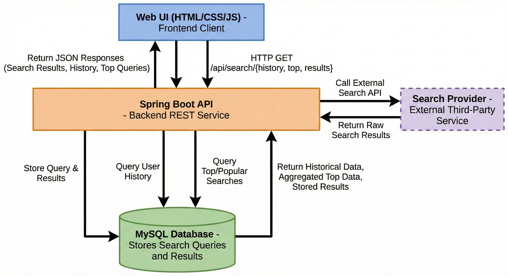

# Realtime Web Page Search Engine


## Description
Realtime Web Page Search Engine is a search backend with a simple UI. It fetches live search results, computes relevance signals, and stores queries/results in MySQL for inspection, analytics, and reuse. It is built for students and developers who want a transparent, inspectable search pipeline rather than a black-box search experience.

## Features

- Realtime search with pagination support.
- Relevance scoring based on rank plus cosine similarity metrics stored for analysis.
- Search history, top queries, and stored results retrieval.
- Update and delete operations for stored results and history.
- Simple web UI for searching and viewing insights.

## Architecture Diagram




## API Endpoints

| Method | Path | Description |
| --- | --- | --- |
| POST | `/api/search` | Searches the web via Serper and returns ranked results with relevance score. |
| GET | `/api/search/history` | Returns the 10 most recent search queries. |
| GET | `/api/search/top` | Returns the 10 most frequent search queries. |
| GET | `/api/search/results?query=...` | Returns stored results for a given query from MySQL. |
| PUT | `/api/search/results/{id}` | Updates rank or scores for a stored result. |
| DELETE | `/api/search/results/{id}` | Deletes a stored result by id. |
| DELETE | `/api/search/results?query=...` | Deletes stored results for a given query. |
| DELETE | `/api/search/history/{id}` | Deletes a search query by id. |
| DELETE | `/api/search/history?query=...` | Deletes search history by query text. |

### `POST /api/search`

Request body:
```json
{
  "query": "saveetha engineering college",
  "page": 0,
  "size": 10
}
```

Response (example):
```json
[
  {
    "pageId": 1,
    "url": "https://example.com",
    "title": "Example",
    "score": 1.0,
    "rank": 1
  }
]
```

### `GET /api/search/history`

Response (example):
```json
[
  {
    "id": 12,
    "queryText": "saveetha engineering college",
    "searchedAt": "2026-02-10T12:30:00"
  }
]
```

### `GET /api/search/top`

Response (example):
```json
[
  {
    "query": "saveetha engineering college",
    "count": 5
  }
]
```

### `GET /api/search/results?query=saveetha%20engineering%20college`

Response (example):
```json
[
  {
    "pageId": 1,
    "url": "https://example.com",
    "title": "Example",
    "score": 1.0,
    "rank": 1
  }
]
```

### `PUT /api/search/results/{id}`

Request body:
```json
{
  "rank": 1,
  "relevanceScore": 1.0,
  "cosineSimilarity": 0.42
}
```

Response (example):
```json
{
  "id": 5,
  "queryText": "apple inc",
  "cosineSimilarity": 0.42,
  "relevanceScore": 1.0,
  "rank": 1
}
```

### `DELETE /api/search/results/{id}`

Response:
```
204 No Content
```

### `DELETE /api/search/results?query=saveetha%20engineering%20college`

Response (example):
```json
5
```

### `DELETE /api/search/history/{id}`

Response:
```
204 No Content
```

### `DELETE /api/search/history?query=saveetha%20engineering%20college`

Response (example):
```json
3
```

## Class Diagram


## Workflow

1. User opens the frontend at `/` and submits a search query.
2. The frontend sends `POST /api/search` with `query`, `page`, and `size`.
3. The backend forwards the query to Serper and receives ranked results.
4. For each result, the backend computes cosine similarity and a relevance score.
5. The backend stores the search query, web page, and ranking data in MySQL.
6. The backend returns the results to the frontend for display.


